# Веб-приложение "Чат"

Статус публикации ветки "deploy":

## Назначение

Яндекс.Практикум. Учебный проект 1-го блока курса "Мидл фронтенд-разработчик" 

## Актуальная версия

 - Деплой: https://competent-payne-8c0936.netlify.app
 - Исходники: [v3.0.1](https://github.com/jasper7466/mf.messenger.praktikum.yandex/tree/v3.0.1)
 
## Краткое описание

Проект представляет собой SPA-приложение, реализующее функционал чата со следующими экранами:

- Аторизация
- Регистрация
- Чат
- Профиль
- Страница HTTP-кодов ошибок

## Исходные данные для разработки

В качестве макета прототипа использован дизайн, предложенный образовательной платформой с незначительными доработками.

- Макет в Figma: https://www.figma.com/file/WWatgxaRSJ86THRxGmKn3i/Chat-(modified)

 
Изображения макета экранов (кликните, чтобы развернуть)

 

  
Вход и регистрация

  
Форма входа

  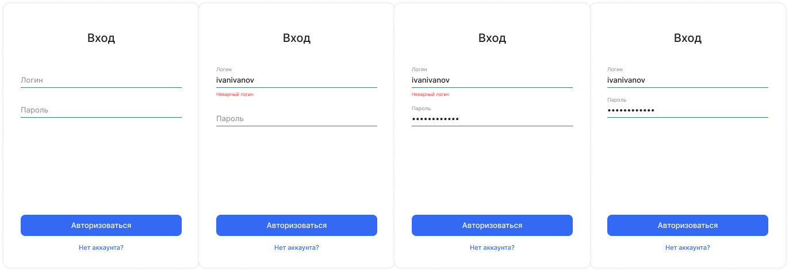
  
Страница входа

  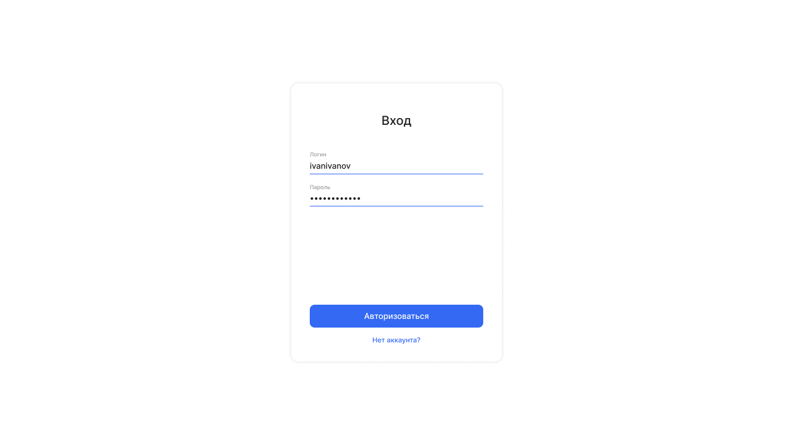
  
Страница регистрации

  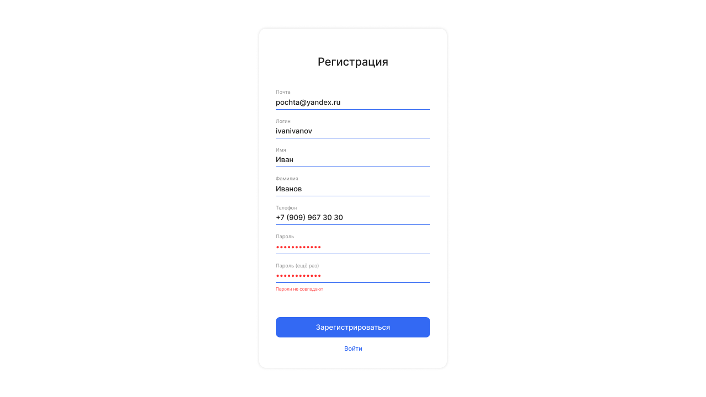
 

 

  
Чат

  
Выбор чата

  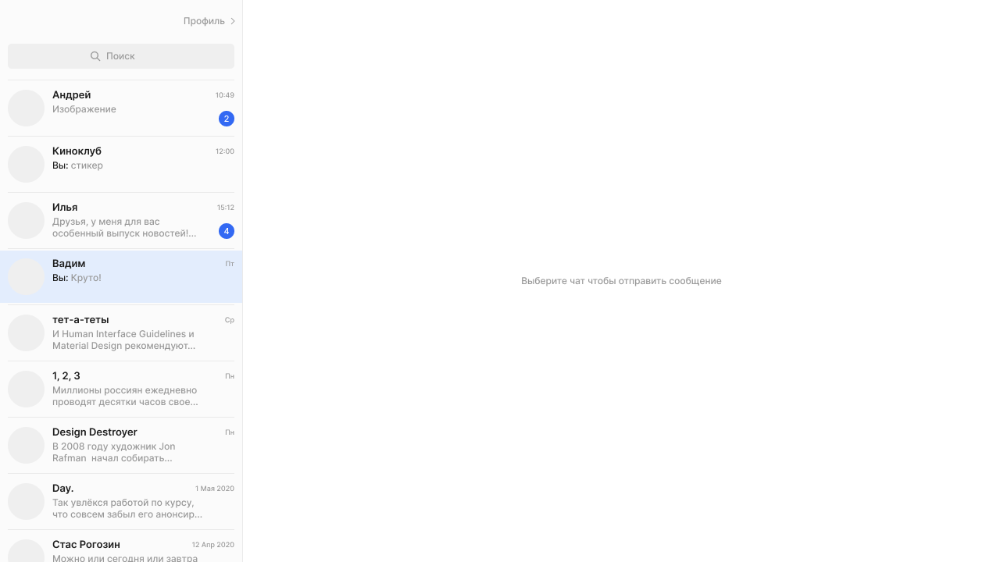
  
Чат

  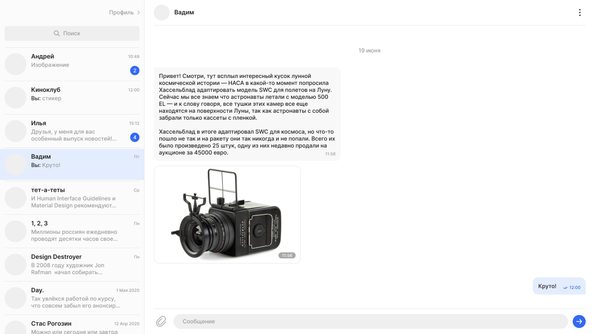
  
Поиск

  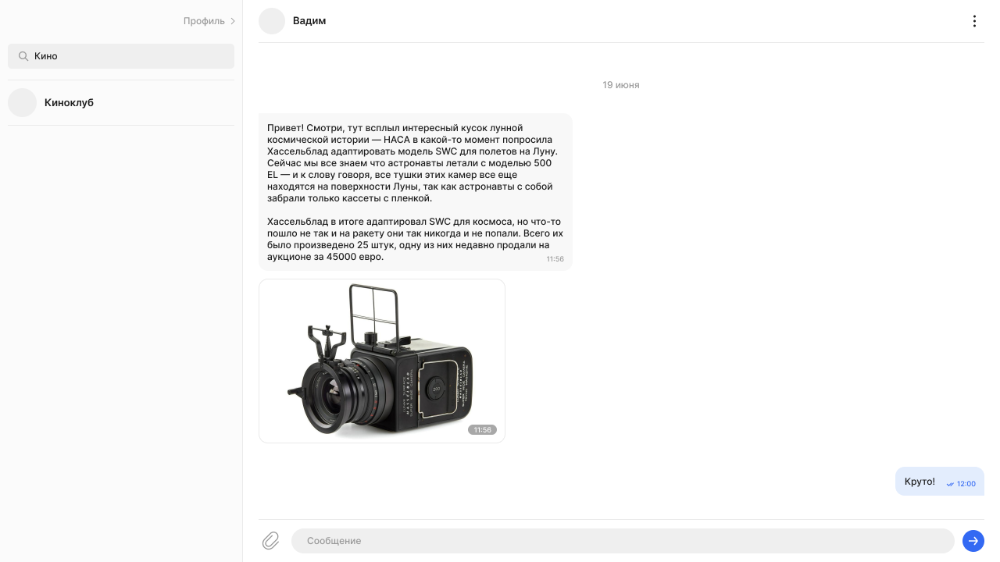
  
Функции чата

  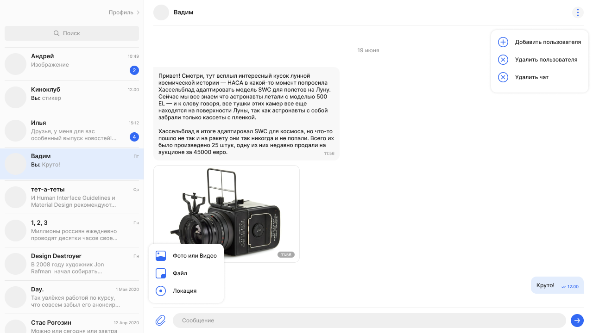
  
Действия в чате

  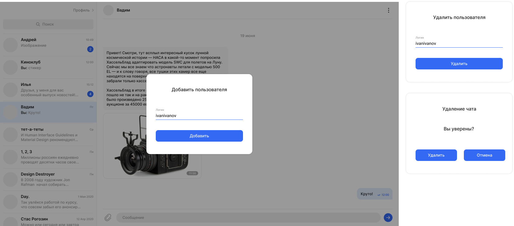
 

 

  
Профиль

  
Профиль

  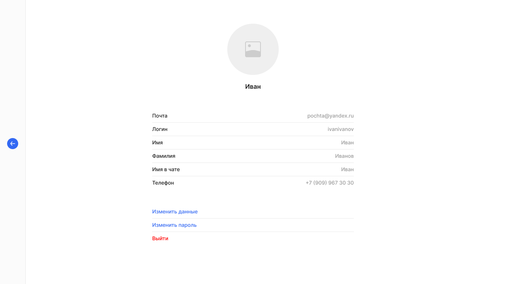
  
Изменить данные

  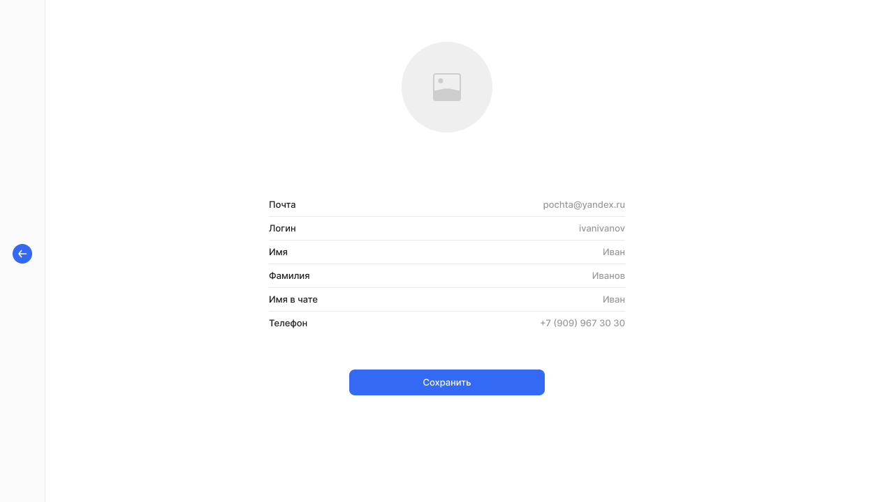
  
Изменить пароль

  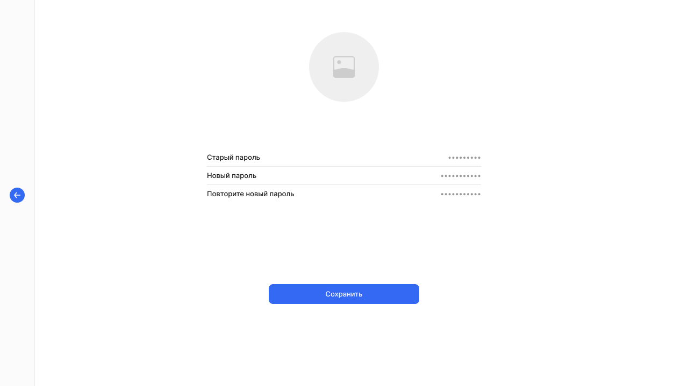
  
Аватар

  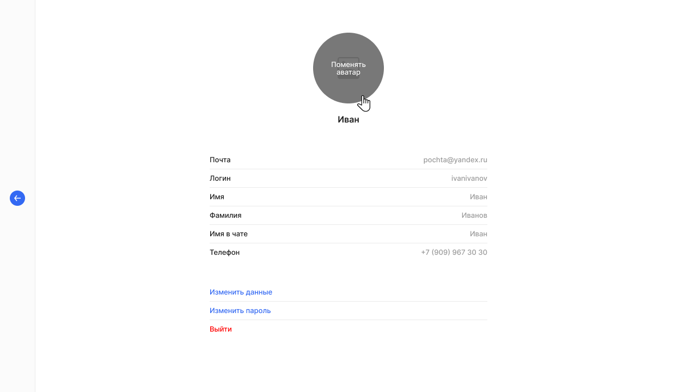
  
Загрузить аватар

  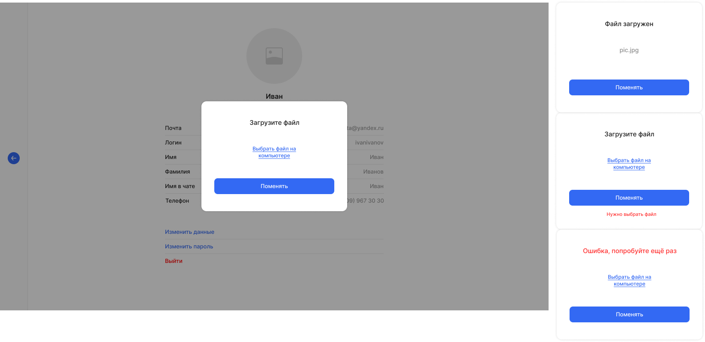
 

 

  
Страницы кодов состояния

  
Страница 404

  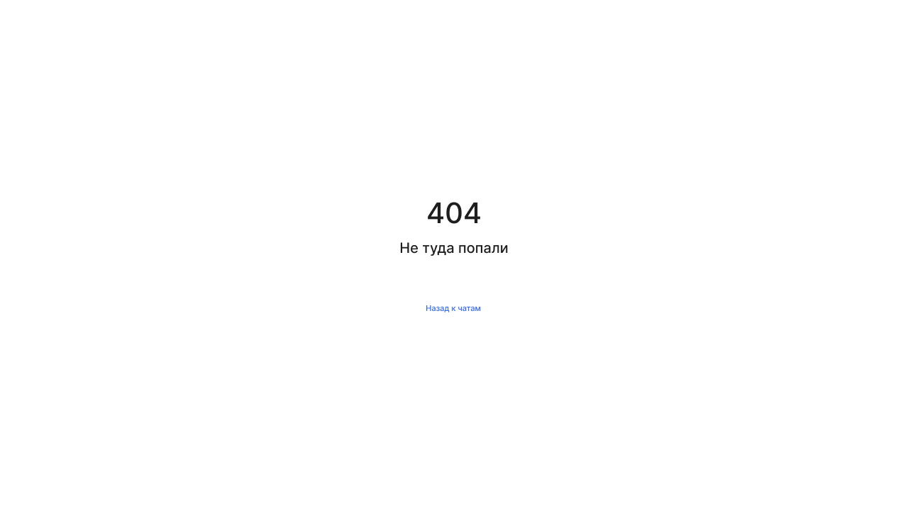
  
Страница 500

  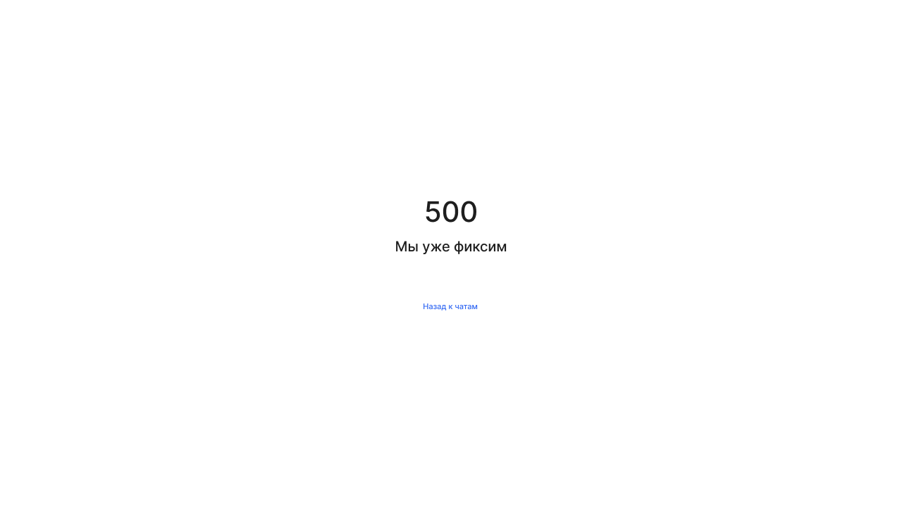
 

## Как развернуть проект

Установка пакетов осуществляется через [Node Package Manager (NPM)](https://nodejs.org/en/download/).

Версии пакетов и их зависимостей зафиксированы в файлах *package.json* и *package-lock.json*, для автоматической установки достаточно выполнить команду `npm install` в корневой директории проекта.

В конфигурационном файле настроены следующие варианты запуска сборки проекта:

- `npm run compile` - Компиляция. Файлы статики и необходимые ассеты из *./static* копируются в директорию *./dist* с сохранением структуры каталогов, запускается компиляция ts-файлов с сохранением полученных js-файлов в ту же директорию *./dist*.

- `npm run start` - Запуск локального сервера с раздачей статики на порту 4000

- `npm run test` - Запуск автоматических тестов

## История изменений

    
v1.0.0 - Спринт 1

        - Создана заготовка описания проекта
        - Добавлены изображения макета экранов приложения
        - Настроен Express-сервер с раздачей статики
        - Настроен автодеплой на Netlify из ветки deploy
        - Свёрстаны основные экраны приложения
        - Реализован вывод данных форм в консоль по событию "submit"
        - Реализована временная навигация по экранам посредством ссылок

    
v2.0.0 - Спринт 2

        - Незначительно изменена файловая структура проекта
        - Внедрён TypeScript, настроен скрипт компиляции статики и ts-файлов
        - Изменён билд-конфиг для публикации на Netlify
        - Подключен шаблонизатор Handlebars
        - Реализованы модули "EventBus" и "Component"
        - Реализован и переиспользован компонент "Button"
        - Реализован модуль валидации форм, настроена валидация основных форм

    
v2.0.1 - Спринт 2, рефакторинг после ревью

        - Вся статика вынесена в корень проекта в директорию "./static"
        - Директория "./static" вновь добавлена в git-индекс (т.к. в ней теперь тоже исходники)
        - Поправлены некоторые относительные пути в соответствии с изменённой структурой каталогов
        - Перенастроен скрипт "сборки" (как и прежде: продукты сборки помещаются в ./dist, туда же копируются исходники статики) 
        - Поправлен конфиг express-сервера
        - Удалён незавершённый и неиспользуемый в проекте самописный модуль шаблонизатора

    
v3.0.0 - Спринт 3, частичная реализация

        - Реализованы классы HTTPTransport и некоторые API
        - Реализованы классы Route, Router и роутинг
        - Реализована подстановка расширений в импортах *.ts-файлов при компиляции
        - Реализовано хранилище Store (частично)
        - Реализован класс Controller
        - Немного дополнен жизненный цикл компонента
        - Довёрстаны модальные окна
        - Частично реализовано сопряжение UI приложения с API

    
v3.0.1 - Спринт 3, исправления после ревью, доработка

        - Для API создан базовый класс с обработчиком ошибок транспорта
        - Реализована обработка перехода на несуществующий раут
        - В контроллерах страниц добавлен try-catch отлов ошибок асинхронных операций для нотации async-await
        - Настроен запуск авто-тестов
        - Добавлена поддержка JSDOM
        - Написаны тесты для модулей Component и Router
        - Исправлены замечания ревью

## Технологии

 - HTML5
 - JS
 - TS
 - CSS
 - Git
 - Express
 - Netlify